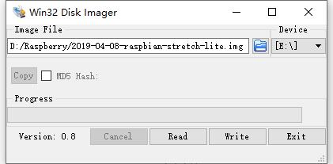
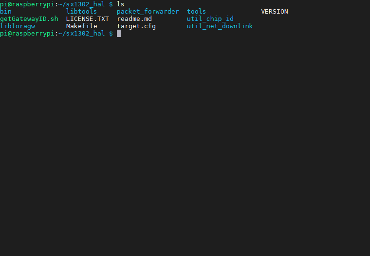
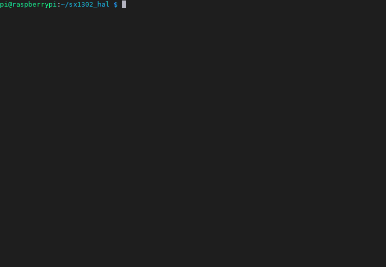
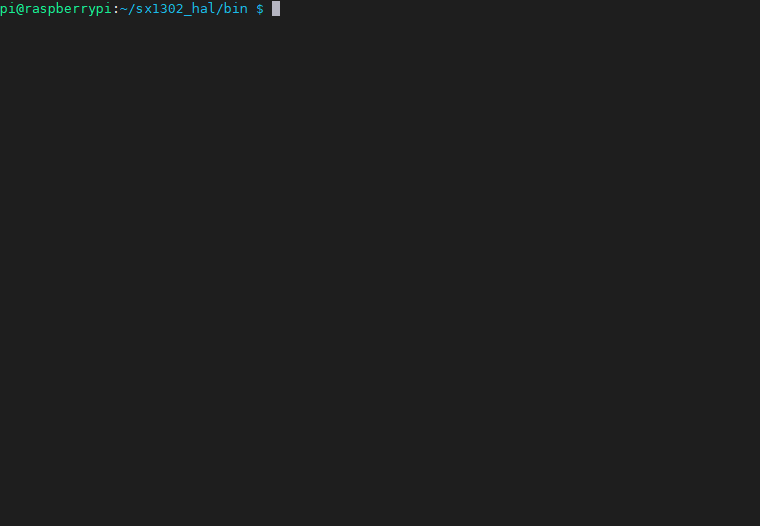
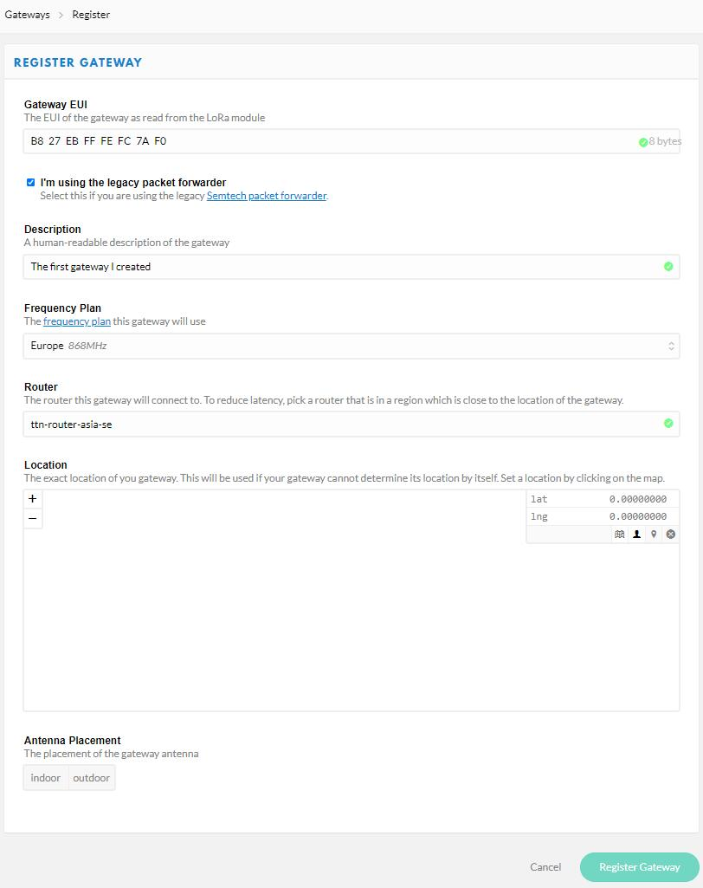
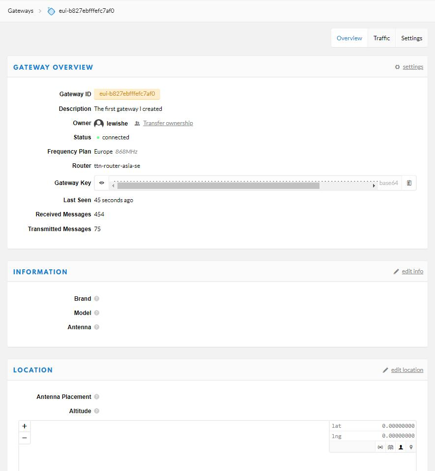
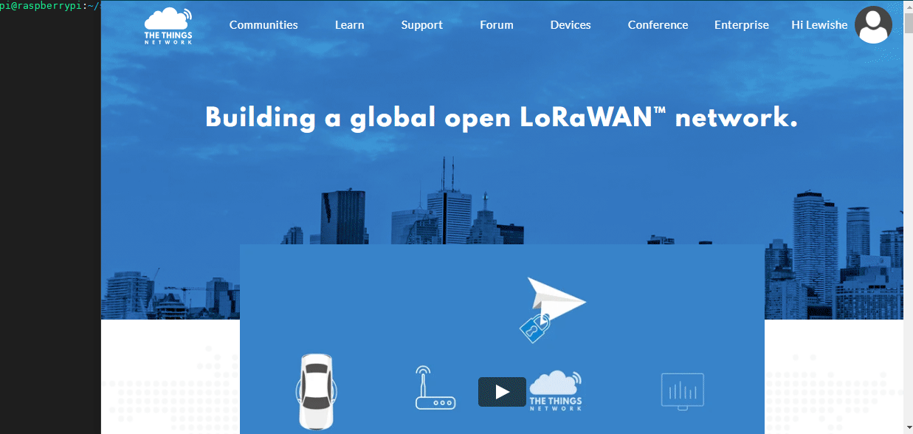

SX1302_HAL_GATEWAY

========================

## **English | [中文](docs/README.MD)**

The following tutorial uses Raspberry Pi 3B+


1. Download the Raspberry Pi image, I am using Debian9 at the time of writing
    ```
    https://www.raspberrypi.org/downloads/
    ```

2. Use [Win32DiskImager](https://win32diskimager.org/) for image burning
    
    


3. Set root password
    ```
    sudo passwd root
    > Enter root password
    ```

4. Update apt source
    ```
    sudo apt update
    ```

5. Enable Raspberry Pi SPI
    ```
    sudo raspi-config
    ```

    

6. Clone sx1302_hal & compile
    ```
    cd ~
    git clone https://github.com/Xinyuan-LilyGO/sx1302_hal
    cd sx1302_hal
    make clean all            #Generate executable file
    make install              #Copy the compiled executable file to the target directory
    make install_conf         #Copy the default configuration file to the target directory
    ```
    

7. Generate Gateway ID
    ```
    cd ..
    chmod +x getGatewayID.sh
    #This will generate the GatewayID, record it and replace the `gateway_ID` field in global_conf.json
    ./getGatewayID.sh         
    ```
    

8.  Configure global_conf

    ```
    cd bin
    # Copy the corresponding configuration file of the lora gateway. I purchased EU868, so I renamed `global_conf.json.sx1250.EU868` to `global_conf.json`

    cp global_conf.json.sx1250.EU868 global_conf.json   
       
    vim global_conf.json 

    `gateway_ID` field, replace with the string generated by running ./getGatewayID.sh

    The `server_address` field is filled in with the server you want to connect to, here I use the TTN server, and the IP address I use for the Asia Pacific server is "router.eu.thethings.network"

    `serv_port_up` is the upstream port of the server, TTN defaults to 1700

    `serv_port_down` is the downstream port of the server, TTN defaults to 1700

    GPS and Beaconing comment out all of it. If you don’t comment, it won’t affect you. Adjust it yourself according to your needs. Because I don’t use GPS, these are useless.

    Don’t change the others temporarily, keep the default, Shift + ZZ to save
    ```

    

9.  Test packet forwarding
    ```
    ./lora_pkt_fwd global_conf.json
    ```
    


10. Create a gateway in TTN
    ```
    1. [First you need to register the gateway](https://console.thethingsnetwork.org/gateways/register)
    2.Check `I'm using the legacy packet forwarder`, use the old packet forwarder
    3.Fill in the `gateway_ID` in the configuration file in `Gateway EUI`
    4.Write anything in the `Description` column
    5.`Frequency Plan` is configured according to the actual frequency of use
    6.`Router` chooses the region closest to itself
    7.Fill in and click `Register Gateway` to complete the creation
    ```

    The picture below is a screenshot of my configuration
    


11. View gateway connection status

    Click on Gateways at the top right of the webpage, and then the registered gateway will be displayed. Click on the gateway just created to check whether the gateway is connected. The figure below shows the connection status. You can see that the status is displayed as connected. So far, simply use packet forwarding to access TTN is complete, provided that you need a node to access the gateway first, and the node device has been registered in TTN, otherwise the gateway status will not display the connection

    
    


