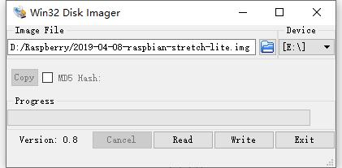
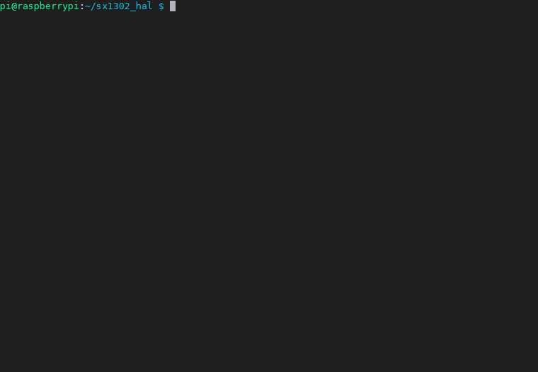
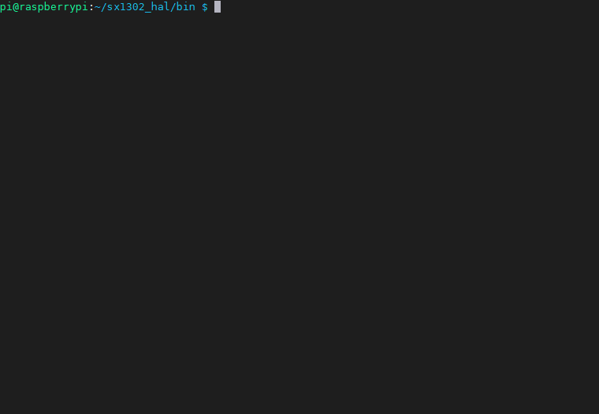

SX1302_HAL_GATEWAY

========================
## **[English](../README.MD) | 中文**

以下教程使用的是树莓派3B+


1. 下载树莓派镜像,写这个时候我使用的是Debian9
    ```
    https://www.raspberrypi.org/downloads/
    ```

2. 使用[Win32DiskImager](https://win32diskimager.org/)进行镜像烧写
    
    


3. 设定root密码
    ```
    sudo passwd root
    > 输入root的密码
    ```

4. 更新源
    ```
    sudo apt update
    ```

5. 开启树莓派SPI
    ```
    sudo raspi-config
    ```

    

6. 克隆sx1302_hal & 编译
    ```
    cd ~
    git clone https://github.com/Xinyuan-LilyGO/sx1302_hal
    cd sx1302_hal
    make clean all            #生成执行文件
    make install              #将编译的执行文件拷贝到目标目录
    make install_conf         #拷贝默认的配置文件到目标目录 
    ```
    

7. 生成getGateway ID
    ```
    cd ..
    chmod +x getGatewayID.sh
    #这个将生成GatewayID，将他记录下来替换global_conf.json `gateway_ID`字段
    ./getGatewayID.sh         
    ```
    

8.  配置global_conf

    ```
    cd bin
    # 拷贝lora网关的对应的配置文件,我购买的是EU868的,所以将`global_conf.json.sx1250.EU868`重命名为`global_conf.json`

    cp global_conf.json.sx1250.EU868 global_conf.json   
       
    vim global_conf.json 

    `gateway_ID`字段，替换为运行./getGatewayID.sh生成的字符串

    `server_address`字段 填写为你要连接的服务器，这里我使用TTN的服务器,IP地址我使用亚太服务器的地址为"router.eu.thethings.network",

    `serv_port_up` 为服务器的上行端口，TTN默认为1700

    `serv_port_down` 为服务器的下行端口，TTN默认为1700

    GPS 和 Beaconing 把它全部注释掉，不注释也不影响，根据需求自己调整，因为我没有使用GPS所以这些都没用 

    其他暂时不做更改，保持默认,Shift + ZZ 保存
    ```

    

9.  测试包转发
    ```
    ./lora_pkt_fwd global_conf.json
    ```
    


10. 在TTN中创建网关
    ```
    1. [首先需要注册网关](https://console.thethingsnetwork.org/gateways/register)
    2.勾选`I'm using the legacy packet forwarder`，用旧式包转发器
    在`Gateway EUI`中填入配置文件中的`gateway_ID`
    3.`Description`一栏任意写点什么
    4.`Frequency Plan` 根据实际使用频率配置
    5.`Router`选择与自己最接近的地区
    6.填写完成点击`Register Gateway`完成创建
    ```

    下图是我的配置截图
    


11. 查看网关连接状态

    点击网页右上方Gateways,然后显示已经注册的网关，点击刚才创建的网关，即可查看网关是否已经连接上,下图为连接状态,可以看到status显示为connected,至此简单的使用包转发接入TTN就完成了，前提你需要有节点先接入网关，并且已经在TTN中注册了节点设备，否则网关状态不会显示连接

    
    


